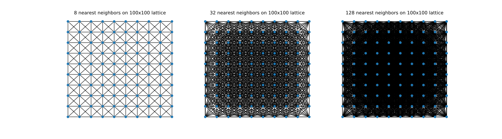
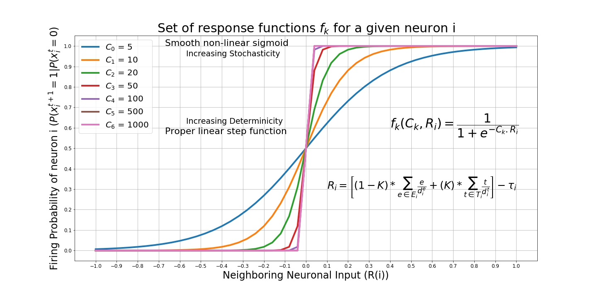

Introduction
==============
Here, we develop computational framework for interplay between the dynamics (spreading process) and network topology manifesting through higher-order connections embedded in a manifold structure for neuronal activity. One can study spatio-temporal patterns of STM cascades over noisy geometric complexes, which contain both short- and long-range simplices and are a generalization of noisy geometric networks.

In this module, one can investigate the dynamics of a Simplicial Threshold model (STM) starting from a seed cluster and spreading across the underlying simplicial complex. The model and hence the package is as general as possible in a way that one can play with the parameters to obtain different network topologies and cascade models. There are 3 main parameter groups summarized under *Network paramaters*, *Dynamics parameters* and *Neuron parameters*.

.. figure:: active_triangles_copy.pdf
   :width: 200px
   :height: 200px
   :scale: 300 %
   :align: center

Geometric and Noisy Geometric Ring complexes
******************************************************

A geometric network is a set of nodes and edges where the nodes connected to their 'close' neighbors in a euclidean distance manner.

Noisy geometric networks are obtained by connecting 'distant' vertices of the geometric network. These network topology manipulations are shown to demonstrate various contagion spread phenomenans such as wavefront propagation (WFP) or appearance of new clusters (ANC) in these networks. 
   
A noisy ring complex involves vertices that lie along a 1D manifold that is embedded in a 2D ambient space. (Vertices are placed slightly alongside the manifold to allow easy visualization of 2-simplices.)  Each vertex has :math:`d^{(G)}` geometric edges to nearby vertices and :math:`d^{(NG)}` nongeometric edge to a distant vertex. Higher-dimensional simplices arise in the associated clique complex and are similarly classified.  An STM cascade exhibits WFP when it progresses along the ring manifold, and ANC events when it jumps across a long-range edge or higher-dimensional simplex.

.. code-block:: python

    #### NETWORK PARAMETERS ####
    size = 400 # number of neurons
    GD = 10 # geometric degree
    nGD = 4 # non-geometric degree
    topology = 'Ring' or 'random_Ring'
    noise_type = 'k-regular' or 'ER-like' or '2D_k-regular'

.. figure:: RINGS.pdf
   :width: 300px
   :height: 500px
   :scale: 500 %
   :align: center
   
Alternatively, one can input any adjacency matrix in order to run simulations on other networks that are not generated by the above options. In that case, network parameters can be modified as below.

.. code-block:: python

    #### NETWORK PARAMETERS ####
    size = 400
    G = nx.grid_2d_graph(size, size)
    topology = 'lattice'
    matrix = nx.adjacency_matrix(G).todense()

Simplicial Threshold Model
************************************
We are inspired by neuoronal cascades to asses the spreading phenomena. The core function that we run our experiments decides if a given neuron is going to fire or not by a sigmoid function :math:`f(R_{i},C) = \frac{1}{1+\exp^{-C.R_{i}}}` where :math:`R_{i}`, the simplicial exposure, is a function of current network history defined by :math:`R_{i} = \left[(1-K)*\sum_{e \in E_{i}} \frac{e}{d_{i}^{e}} + (K)*\sum_{t \in T_{i}}\frac{t}{d_{i}^{t}}\right] - \tau_{i}` where :math:`E_{i}` is the set of active edge neighbors, :math:`T_{i}` is the set of active triangle neighbors of node :math:`i`, :math:`d_{i}^{e}` and :math:`d_{i}^{t}` are edge and triangle degrees of node :math:`i` respectively. The constant :math:`K` ,2-simplex influence, is used to strike a balance between traditional activation maps and higher order, or simplicial, cascade maps.

The main class we use ``Geometric_Brain_Network`` comes with several methods that we can manipulate the nature of the contagion very easily. For example, one can run either a stochastic or deterministic model by varying the parameter :math:`C`. Moreover, :math:`K=0` recovers an edge contagion whereas :math:`K=1` recovers a pure triangle contagion.

.. code-block:: python

    #### DYNAMICS PARAMETERS ####
    K = 0.5 # 2-simplex influence ranging between 0 and 1. edge-dominant model if 0, triangle-dominant model if 1.
    C = 10000 # Stochasticity parameter. Higher the more deterministic
    TIME = 500 # Number of discrete time-steps to run one single cascade
    seed = 200 # seed node to initialize the cascade

   
   Set of neuronal activation functions as a function of :math:`C`.

Neuronal Subtypes
****************************

In the package, ``Geometric_Brain_Network`` object has a subclass called ``neuron`` which can have individual activation thresholds as well as memory and refractory periods as a function of discrete time steps. This generalization enables heterogenity in the experiments as well as complexity of the non-trivial interactions.

.. code-block:: python

    #### NEURON PARAMETERS ####
    threshold = 0.1 # vertex activation threshold
    memory = TIME # number of discrete time steps that neuron stays active once they are active. If 0, neuron will stay active only 1 time step.
    rest = 500 # number of discrete time-steps that neuron stays in the refrectaroy period. In this state, neuorons are not allowed to get active.

.. figure:: neuron_types.pdf
   :width: 300px
   :height: 500px
   :scale: 500 %
   :align: center