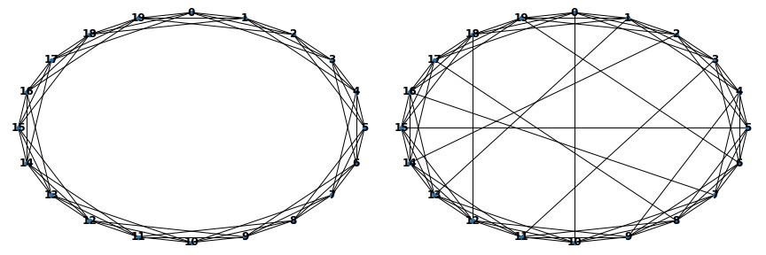
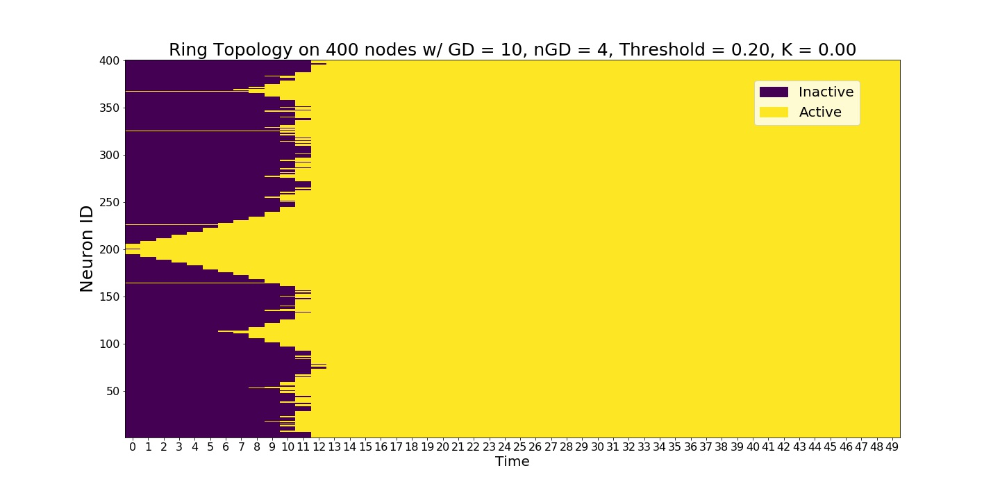
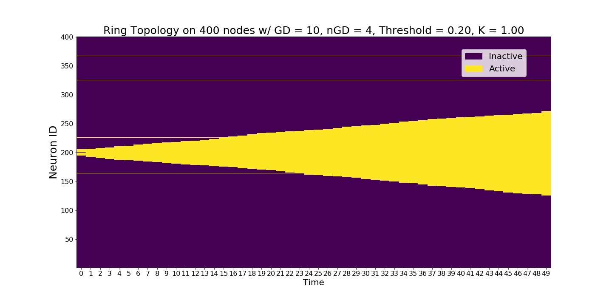
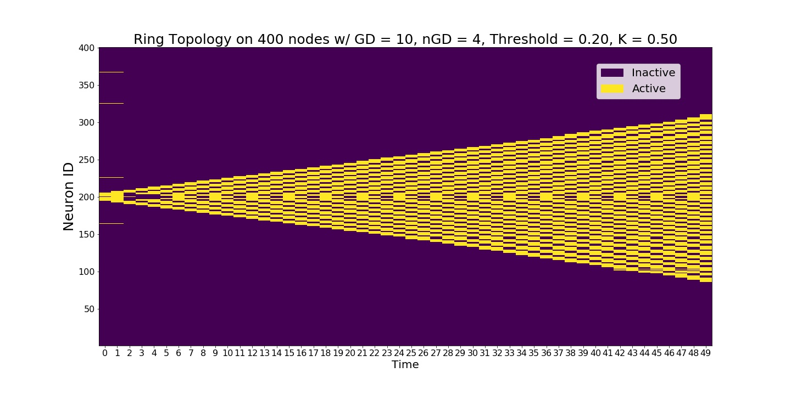
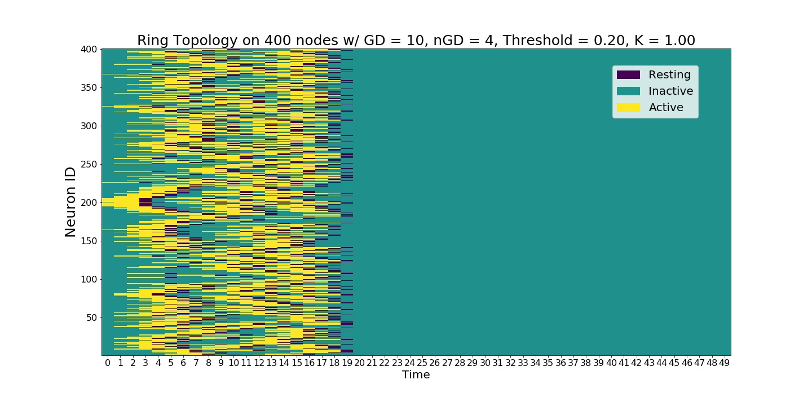
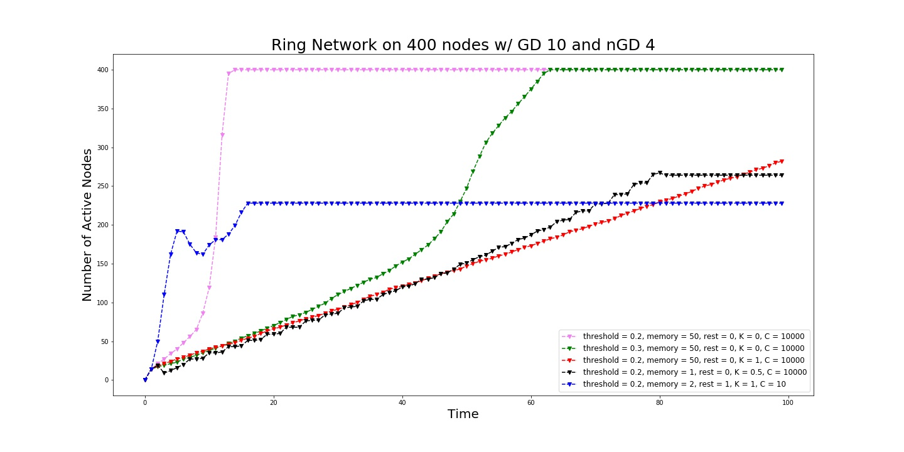
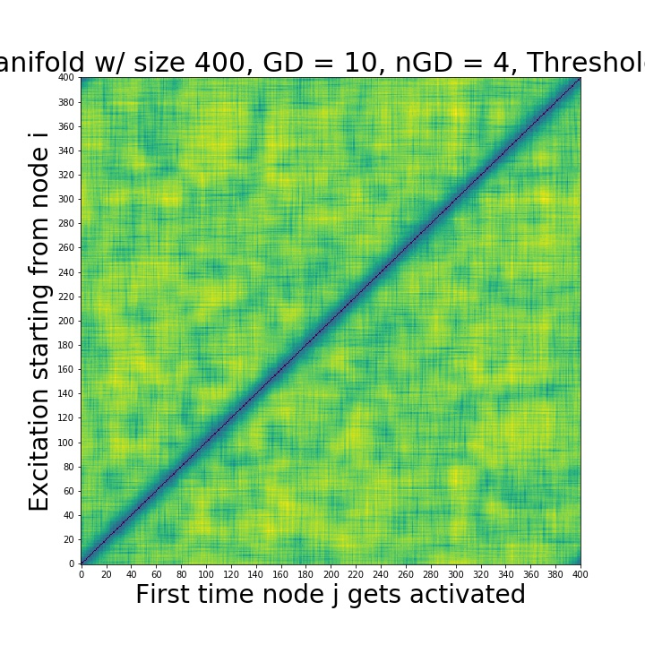
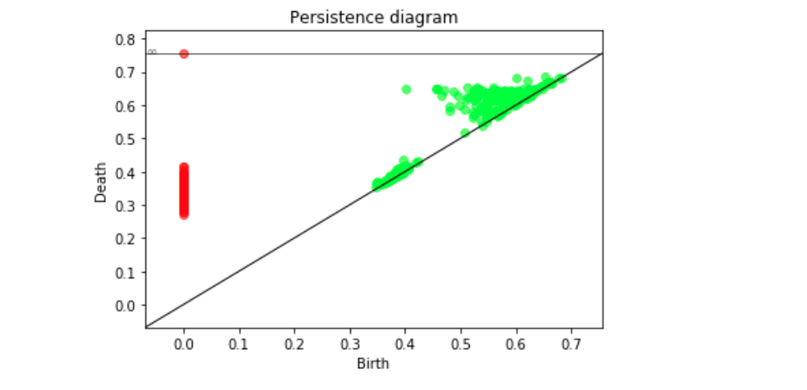

Tutorial
===============

Installation/Usage
*********************
As the package has not been published on PyPi yet, it CANNOT be install using pip. ``Neuronal Cascades`` uses cython to exploit the computational efficiency. So, you have to ``setup.py`` the *.pyx files in Neuronal_Cascades_base

For now, the suggested method is having the same folder directory in Neuronal_Cascades/Simplicial_Model (setup.py has to be in the parent directory of Neuronal_Cascades_base). Then, add an empty __init__.tex file into Neuronal_Cascades_base (Github doesn't allow adding empty files). Then go to this directory on your terminal and run ``python setup.py build_ext --inplace``. See https://cython.readthedocs.io/en/latest/src/userguide/source_files_and_compilation.html for details.

Initiate a ``Geometric_Brain_Network`` object
*********************************************
Create a geometric network on a ring. ``Band_length`` corresponds to the number of neighbors to connect from both right and left making the geometric degree 2*band_length

.. code-block:: python
    #### NETWORK VARIABLES
    size = 400 ## number of neurons
    GD = 10 # geometric degree
    nGD = 4 # non-geometric degree
    topology = 'Ring' ## only ring available so far
    BN = Geometric_Brain_Network(size, geometric_degree = GD, nongeometric_degree = nGD, manifold = topology)

Inheriting ``neuron`` objects
**************************************
Define neuronal properies and then use ``get_neurons`` to inherit individual neurons into the network.

.. code-block:: python
	#### EXPERIMENT VARIABLES
    TIME = 100 ## number of iterations
    seed = int(size/2) ## seed node
    C = 10000 ## constant for tuning stochasticity(high C yields deterministic experiments)
    K = 0 ## constant weighing the edges vs triangles K=0 pure edge contagions, K=1 pure triangle contagion
    trials = 1 # number of trials per set of variables

    #NEURON VARIABLES
    threshold = 0.2 # node threshold
    memory = TIME ##When a node is activated, it stays active forever(SI model) when memory = TIME.
    rest = 0# neurons don't rest

    ##INITIATE NEURONS and Inherit them
    neurons_1 = [neuron(i, memory = memory, rest = rest, threshold = threshold) for i in range(size)]
    BN.get_neurons(neurons_1)## this is for runnning experiments with new set of neurons without changing the network
    
Run a single example contagion.
****************************************
Core function ``run_dynamic`` runs an experiment with given variables.

.. code-block:: python
    activation1, Q1 = BN.run_dynamic(seed, TIME, C, K)

   
Running experiments without changing the network conectivity
****************************************************************
One may want to work with a different set of experiment or neuronal variables without changing the underlying topology. This is when ``get_neurons`` function comes handy.

.. code-block:: python
    ## with a new set of variables you can run a new experiment without changing the network
    K = 0
    threshold = 0.3
    memory = TIME
    rest = 0

    neurons_2 = [neuron(i, memory = memory, rest = rest, threshold = threshold) for i in range(size)]
    BN.get_neurons(neurons_2)
    
    activation2, Q2 = BN.run_dynamic(seed, TIME, C, K)
    
.. image:: single_exp2.jpg
   	:width: 200px
   	:height: 200px
   	:scale: 500 %
   	:alt: We increased the global node thresholds to 0.3 which slowed down the signal, wavefront.
  	:align: center
    
Runnning Simplicial Contagions
****************************************************************
Simplicial contagions can be ran by simply varying the parameter :math:`K` between 0 and 1.

.. code-block:: python
    ## with a new set of variables you can run a new experiment without changing the network
    K = 1
    threshold = 0.2
    memory = TIME
    rest = 0

    neurons_3 = [neuron(i, memory = memory, rest = rest, threshold = threshold) for i in range(size)]
    BN.get_neurons(neurons_3)
    
    activation3, Q3 = BN.run_dynamic(seed, TIME, C, K)
    

Neurons with memory and refractory period
****************************************************************
Our model is as general as it can be. So, neurons can have arbitrary number of memory or refractory period given in discrete time steps. This generalization increases conmplexity of the dynamics really quick.

.. code-block:: python
    K = 0.5 # average of edge and triangle contagions
    memory = 1## memory of a neuron is how many time steps neurons are going to stay active after they activated once
    rest = 0#rest of a neuron is how many time steps neurons are going to be silent after they run out of memory, refractory period.
    threshold = 0.2

    neurons_4 = [neuron(i, memory = memory, rest = rest, threshold = threshold) for i in range(size)]

    BN.get_neurons(neurons_4)
    
    activation4, Q4 = BN.run_dynamic(seed, TIME, C, K)
    

    
Running stochastic Models
****************************************************************
Stochasticity of the neuronal responses can be adjusted using the experiment variable :math:`C`. Higher values make the system deterministic.

.. code-block:: python
    K = 1 ## triangle contagion
    memory = 2## memory of a neuron is how many time steps neurons are going to stay active after they activated once
    rest = 1#rest of a neuron is how many time steps neurons are going to be silent after they run out of memory, refractory period.
    threshold = 0.2
    C = 10 ## make the system stochastic, higher values(C>500) is going to make the system deterministic

    neurons_5 = [neuron(i, memory = memory, rest = rest, threshold = threshold) for i in range(size)]

    BN.get_neurons(neurons_5)
    
    activation5, Q5 = BN.run_dynamic(seed, TIME, C, K)
    

    
Looking at the Contagion size
*************************************
We can plot the size of the active nodes as a function of time.

.. code-block:: python
    Q = [Q1,Q2,Q3,Q4,Q5]
    fig, ax = BN.display_comm_sizes_individual(Q,labels)

  	
Run a full scale experiment
*******************************
If you don't need to look at the individual contagions starting from different nodes, you can run the contagion starting from node i and calculating the first time it reaches to node j i.e. create a distance matrix who (i,j) entry is the first time the node j activated on a contagion starting from i. Distance matrices enable a global scale TDA analysis.

.. code-block:: python
    FAT, CS = BN.make_distance_matrix(TIME, C, trials, K)
    

  	
  

Persistence Diagrams
**************************
Once we created the distance matrices, we can look at the topological features across different contagions and different topologies.

.. code-block:: python
    delta_min, delta_max = BN.compute_persistence(FAT, spy = True)##returns the lifetime difference of the longest living one cycles(delta_min) and lifetime difference of the longest and shorthest living one cycles(delta_max)

