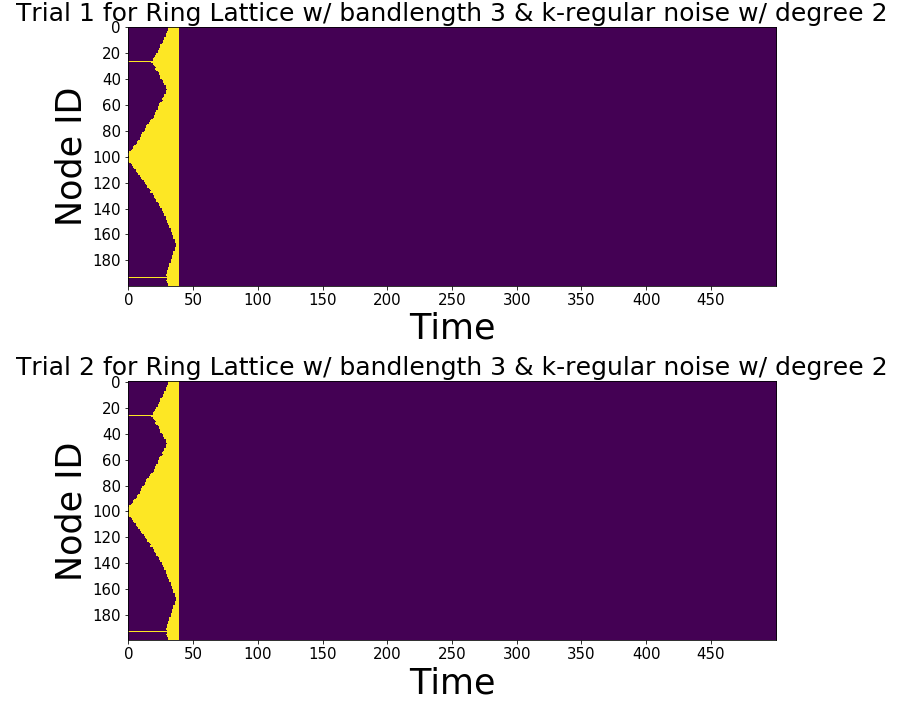

Tutorial
===============

Installation/Usage
*********************
As the package has not been published on PyPi yet, it CANNOT be install using pip.

For now, the suggested method is to put the file `Complex_Contagions.py` in the same directory as your source files and call ``from Complex_Contagions import geometric_network``

Initiate a ``geometric_network`` object
*********************************************
Create a geometric network on a ring. ``Band_length`` corresponds to the number of neighbors to connect from both right and left making the geometric degree 2*band_length

.. code-block:: python

	n = 20
	d2 = 2
	ring_latt=  geometric_network('ring_lattice', size = n, banded = True, band_length = 3)
	
Add noise to geometric network
**************************************
Use ``add_noise_to_geometric()`` method to manipulate the network topology. The second parameter describes the non-geometric degree of every node.

.. code-block:: python

	ring_latt_k_regular.add_noise_to_geometric('k_regular', d2)
	
Display the network via Networkx
****************************************
Spy the network.

.. code-block:: python

	ring_latt_k_regular.display()
	

   
Sample Excitation Simulation
************************************
Run the complex contagion on the network we have created. Key parameters are threshold, C and $\alpha = \frac{nGD}{GD}$

.. code-block:: python

	n = 200
	d2 = 2
	ring_latt_k_regular =  geometric_network('ring_lattice', size = n, banded = True, band_length = 3)
	ring_latt_k_regular.add_noise_to_geometric('k_regular', d2)
	
	T = 100 # number of iterations
	seed = int(n/2) # node that the spread starts
	C = 1000 # Geometrically, this describes the turning of the sigmoid function
	threshold = 0.3 # resistence of the node to it's neighbors' excitation level
	Trials = 2 # number of trials
	refractory_period = False ## if a neuron is activated once, it stays activated throughout.
	
	fig, ax = plt.subplots(Trials,1, figsize = (50,10))
	first_excitation_times, contagion_size = ring_latt_k_regular.run_excitation(Trials, T, C, seed, threshold, refractory_period, ax = ax)
	

  	
Look at the first activation times
*************************************
Spy activation of the nodes.

.. code-block:: python

	ring_latt_k_regular.spy_first_activation(first_excitation_times)

  	
Create Distance Matrix
*******************************
If you don't need to look at the individual contagions starting from different nodes, you can run the contagion starting from node i and calculating the first time it reaches to node j i.e. create a distance matrix who (i,j) entry is the first time the node j activated on a contagion starting from i.

.. code-block:: python

	D, Q = ring_latt_k_regular.make_distance_matrix(T, C, threshold, Trials, refractory_period, spy_distance = True)
	
.. image:: distance_matrix.png
   	:width: 200px
   	:height: 200px
   	:scale: 300 %
   	:alt: The distance matrix.
  	:align: center
  	
  	
Contagion Size
*******************
It's important to look at the bifurcations in the system. In order to do so, one might need to look at the size of the contagion for example different thresholds.

.. code-block:: python

	labels = ['threshold = 0.1', 'threshold = 0.2', 'threshold = 0.3']
	Q = [Q1,Q2,Q3]  ## Qi is the second output of the ``make_distance_matrix``
	ring_latt_k_regular.display_comm_sizes(Q,labels)
	
.. image:: contagion_sizes.png
   	:width: 200px
   	:height: 200px
   	:scale: 300 %
   	:alt: The sizes of the contagion for different thresholds. Shade indicates the max and min values of the contagion starting from different nodes.
  	:align: center
  	
Persistence Diagrams
**************************
Once we created the distance matrices, we can look at the topological features across different contagions and different topologies.

.. code-block:: python

	pers = ring_latt_k_regular.compute_persistence(D, spy = True)
	delta = ring_latt_k_regular.one_d_Delta(pers)
	

	
	
	
	
	
	